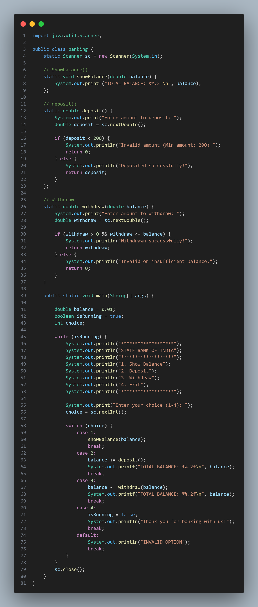
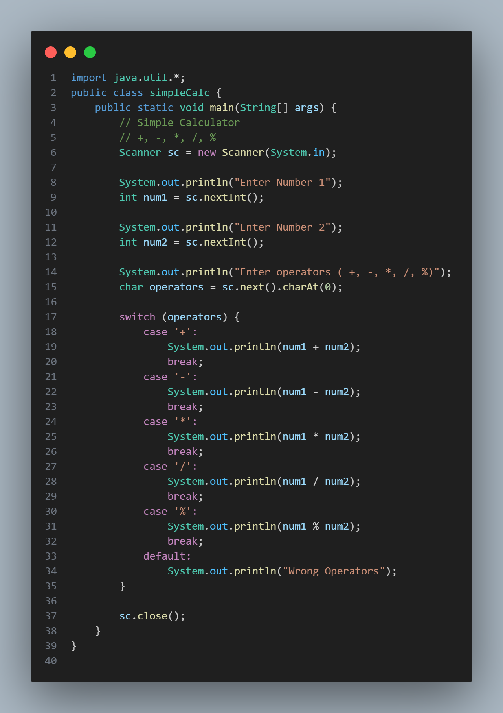
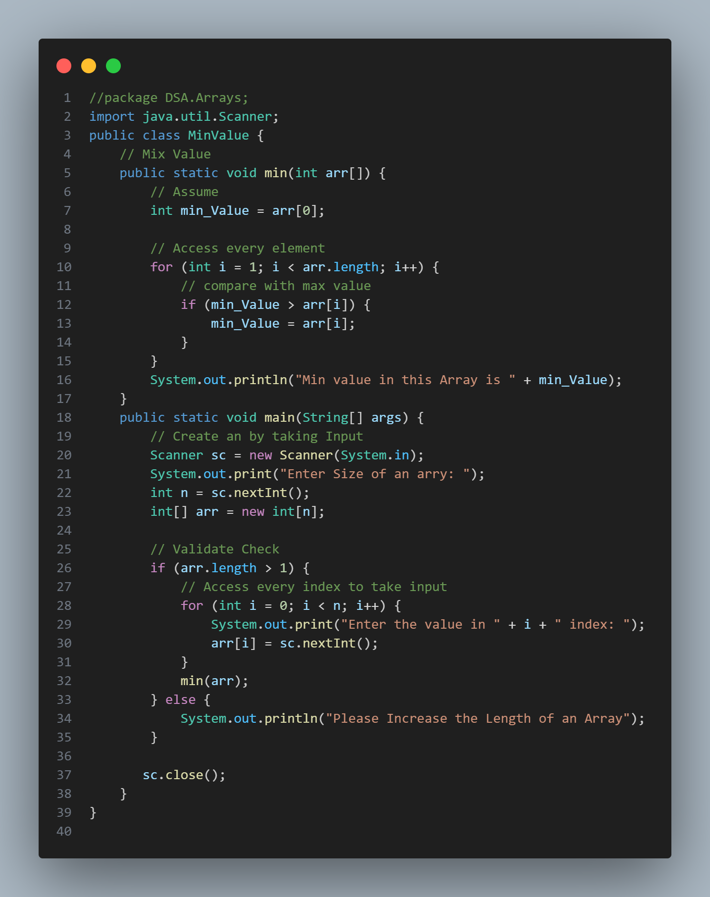

# 📘 Java-DSA Learning Repository

This repository is my personal Java + Data Structures & Algorithms (DSA) learning journey. It contains practice problems, mini projects, and notes to strengthen core Java concepts and improve problem-solving skills.## 📸 Screenshots

### Mini Project Example


### Simple Calculator Example


### DSA Example


## 📂 Project Structure

### Tree View
- **Arrays/** → Array-related problems (search, reverse, rotation, etc.)
- **Mini Project/** → Small Java programs (Banking, Calculator, Games, etc.)
- **Practice Sheet/** → Exercises & problem sets
- **Basics/** → Core Java concepts (loops, functions, recursion, patterns, etc.)
- **Notes.txt** → My quick notes
- **task.txt** → To-do or practice tasks


## Run Locally

Clone the project

```bash
  https://github.com/pbbhattpriyanshu/Java-DSA.git
```

Go to the project directory

```bash
  cd Java-DSA
```

Run Java files

You can compile and run any .java file using:

```bash
  javac filename.java
  java filename
```


## 📌 Topics Covered

✔️ Core Java Basics (variables, datatypes, operators, loops, functions, OOP basics)

✔️ DSA with Java (arrays, searching, recursion, patterns)

✔️ Mini Projects (Calculator, Banking System, Games, Converters)

✔️ Practice Sheets (hands-on coding exercises for revision)

## 🎯 Goals

- Strengthen Java fundamentals

- Improve problem-solving with DSA

- Build mini projects for real-world understanding

- Prepare for interviews & coding challenges

## 📝 Notes


- All practice codes are self-written while learning

- Repo will be updated continuously with new problem
## License

This repository is for educational purposes. Feel free to learn!
