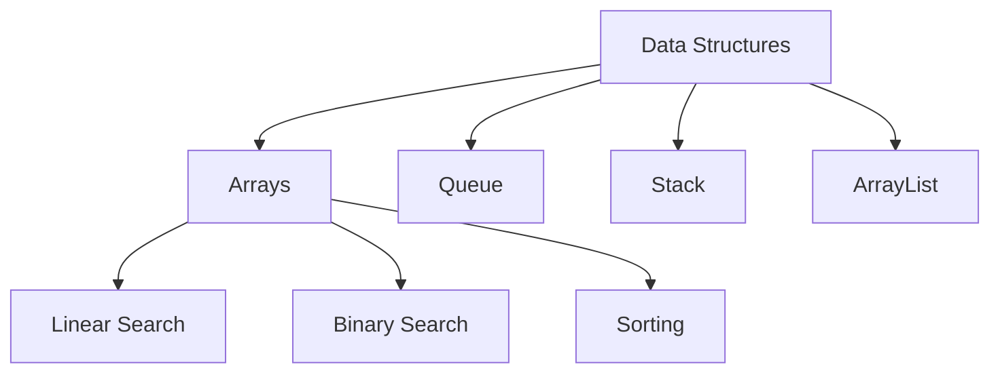
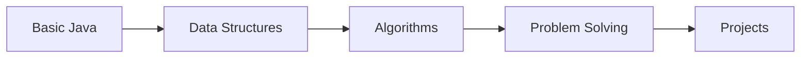

# 🎯 Java DSA Learning Repository

A comprehensive collection of Data Structures, Algorithms, and Mini Projects implemented in Java.

## 📚 Table of Contents
- [Project Structure](#-project-structure)
- [Core Concepts](#-core-concepts)
- [Data Structures](#-data-structures)
- [Mini Projects](#-mini-projects)
- [Practice Problems](#-practice-problems)
- [Getting Started](#-getting-started)

## 📂 Project Structure
```
Java-DSA/
├── DSA/                    # Data Structures & Algorithms
│   ├── Arrays/            # Array operations & problems
│   ├── PracticeDSA/      # Practice implementations
│   └── Notes.txt         # Important concepts & tips
├── Mini Project/         # Standalone applications
├── Practice_Sheet/       # Coding exercises
└── assets/              # Project resources
```

## 💡 Core Concepts
- Variables & Data Types
- Control Flow (Loops, Conditionals)
- Functions & Methods
- Object-Oriented Programming
- Exception Handling
- File I/O Operations

## 📊 Data Structures


## 🎮 Mini Projects
- Banking System
- Calculator Applications
- Games (Cricket, Dice Roller)
- Conversion Tools
- Mad Libs Game

## 💻 Practice Problems
- Array Manipulations
- Pattern Printing
- Mathematical Operations
- String Operations
- Search & Sort

## 🚀 Getting Started

### Prerequisites
- Java JDK 8 or higher
- Any Java IDE (VS Code recommended)

### Installation
```bash
# Clone the repository
git clone https://github.com/pbbhattpriyanshu/Java-DSA.git

# Navigate to project directory
cd Java-DSA

# Compile and run any Java file
javac filename.java
java filename
```

## 📝 Learning Path


## 🎯 Progress Tracking
- [x] Basic Java Concepts
- [x] Arrays and String Operations
- [x] Basic Data Structures
- [ ] Advanced Data Structures
- [ ] Algorithm Analysis
- [ ] Complex Problem Solving

## 🔗 Useful Links
- [LeetCode Progress](https://leetcode.com/progress/)
- [Java Documentation](https://docs.oracle.com/en/java/)

## 📄 License
This project is licensed under the MIT License - see the [LICENSE](LICENSE) file for details.

---
⭐ If you find this repository helpful, please consider giving it a star!
